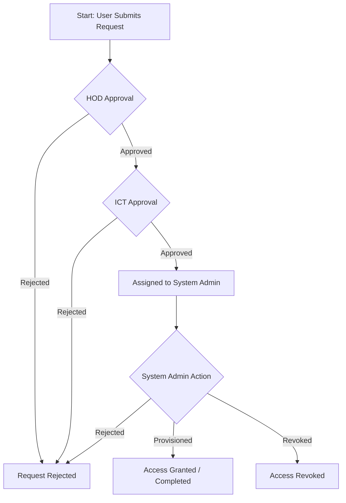

# TSC System Access Management System - Project Manual

## 1. System Overview
The **TSC System Access Management System** is a web-based application designed to streamline and automate the process of requesting, approving, and provisioning access to various internal systems within the organization. It replaces manual paper-based workflows with a digital, auditable, and efficient process.

The system handles the entire lifecycle of an access request:
1.  **Submission**: Staff members submit requests for specific systems (e.g., Active Directory, CRM, IFMIS).
2.  **HOD Approval**: Head of Department (HOD) reviews and approves/rejects the request based on business needs.
3.  **ICT Approval**: ICT department reviews technical feasibility and security implications.
4.  **Provisioning**: System Administrators provision the access and mark the request as complete.
5.  **Notification**: Users are notified at each stage (implied via status updates).

## 2. System Architecture & Workflow

The following diagram illustrates the workflow of an access request:



### Key Components
-   **Frontend**: Django Templates (HTML/CSS/JS)
-   **Backend**: Django Framework (Python)
-   **Database**: MySQL
-   **Authentication**: Custom User Model (TSC Number based)

## 3. User Roles and Permissions

The system defines several user roles, each with specific responsibilities:

| Role | Description | Responsibilities |
| :--- | :--- | :--- |
| **Staff** | General employees | Submit access requests, view request status. |
| **HOD (Head of Department)** | Department Managers | Review and approve requests from staff within their directorate. |
| **ICT** | ICT Department Members | Technical review of requests after HOD approval. Assign requests to specific System Admins. |
| **System Admin** | System-specific Admins | Provision access to specific systems (e.g., AD Admin, CRM Admin). Finalize requests. |
| **Overall Admin** | Superusers | Manage users, roles, directorates, and system configurations. |

## 4. Features

### 4.1 Access Request Management
-   **Multi-System Requests**: Users can request access to multiple systems in a single request (though the model structure suggests one request per system entry or linked items). *Note: The code shows `RequestedSystem` linked to `AccessRequest`, allowing multiple systems per request.*
-   **Request Types**: New User, Change/Modify, Deactivate.
-   **Status Tracking**: Real-time tracking of request status (Pending HOD, Pending ICT, Approved, etc.).

### 4.2 Approval Workflow
-   **Hierarchical Approval**: Enforces the chain of command (HOD -> ICT -> SysAdmin).
-   **Comments**: Approvers can add comments explaining their decisions.
-   **Timestamps**: All actions are time-stamped for audit trails.

### 4.3 User Management
-   **Custom User Model**: Uses TSC Number as the primary identifier.
-   **Role Assignment**: Flexible role assignment (UserRole model).
-   **Directorate Management**: Users are associated with Directorates.

### 4.4 Reporting & Analytics
-   **Dashboards**: Dedicated dashboards for HOD, ICT, and System Admins.
-   **Export**: Ability to export data (e.g., for System Admins).

## 5. Technical Setup & Installation

### Prerequisites
-   Python 3.8+
-   MySQL Server
-   Docker (optional, for containerized deployment)

### Local Development Setup

1.  **Clone the Repository**
    ```bash
    git clone <repository_url>
    cd tsc_system_access
    ```

2.  **Create Virtual Environment**
    ```bash
    python -m venv venv
    source venv/bin/activate  # On Windows: venv\Scripts\activate
    ```

3.  **Install Dependencies**
    ```bash
    pip install -r requirements.txt
    ```

4.  **Configure Database**
    -   Update `DATABASES` in `tsc_system_access/settings.py` with your MySQL credentials.
    -   Ensure the database `tsc_access_db` exists.

5.  **Run Migrations**
    ```bash
    python manage.py makemigrations
    python manage.py migrate
    ```

6.  **Create Superuser**
    ```bash
    python manage.py createsuperuser
    ```

7.  **Run Server**
    ```bash
    python manage.py runserver
    ```
    Access the application at `http://127.0.0.1:8000/`.

### Docker Deployment
The project includes a `Dockerfile` and `docker-compose.yml`.

1.  **Build and Run**
    ```bash
    docker-compose up --build
    ```

## 6. Database Schema Overview

### Key Models (`access_request/models.py`)

-   **`CustomUser`**: Extends `AbstractBaseUser`. Key fields: `tsc_no`, `full_name`, `email`, `directorate`.
-   **`Directorate`**: Represents organizational units. Key fields: `name`, `hod_email`.
-   **`AccessRequest`**: The header for a request. Key fields: `requester`, `request_type`, `status`.
-   **`RequestedSystem`**: Specific systems requested within an Access Request. Key fields: `system` (e.g., AD, CRM), `level_of_access`, `hod_status`, `ict_status`, `sysadmin_status`.
-   **`UserRole`**: Manages user roles and hierarchy. Key fields: `user`, `role`, `directorate` (for HODs), `system_assigned` (for SysAdmins).

## 7. Troubleshooting

-   **Database Connection Errors**: Check `settings.py` database configuration and ensure MySQL service is running.
-   **Static Files**: If styles are missing, run `python manage.py collectstatic`.
-   **Email Errors**: Check `EMAIL_HOST_USER` and `EMAIL_HOST_PASSWORD` in `settings.py`.


